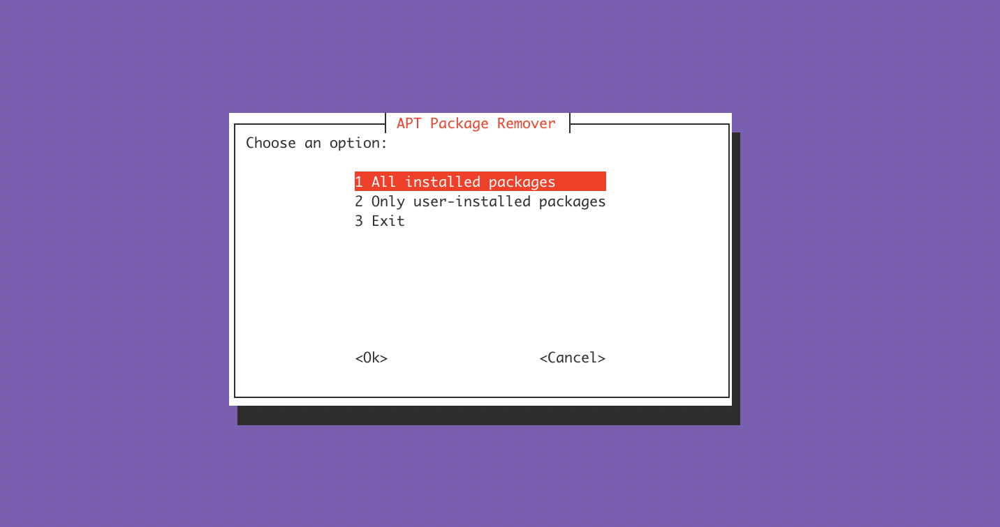
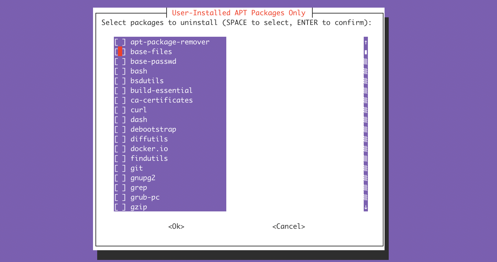
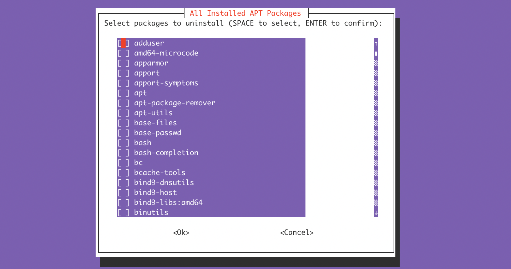

# apt-package-remover
An interactive Bash tool to uninstall installed APT packages on Debian/Ubuntu systems.

📦 Supports:
- All APT-installed packages
- user-installed packages (ignores system dependencies)
- Interactive `whiptail` UI
- Multiple selection with Space + Enter
- Clean removal using `apt purge`

---

## Features

- View **all** or just **user-installed** packages
- Select multiple packages with **Space**
- Confirmation before uninstall
- Uses `apt-get purge`, `autoremove`, and `clean`
- Built as a `.deb` package

---

## Requirements

- Ubuntu/Debian-based Linux
- `whiptail`, `apt`, `dpkg`

---

## Installation

### 1. Download the `.deb` file

```bash
wget https://github.com/itsSwArchitect/apt-package-remover/releases/download/v1.0.0/apt-package-remover_1.0.0_all.deb
```
# Install the package
```bash
sudo dpkg -i apt-package-remover_1.0.0_all.deb
```
# Usage
```bash
sudo apt-package-remover
```
You will be shown a menu:

All installed packages

Only user-installed packages


Use Arrow keys to navigate, Space to select, Enter to confirm.

# Uninstall
```bash
sudo apt remove apt-package-remover
```


# Maintainer
- **Abid Ali**

Developer | DevOps Engineer | ML Resarcher
---


##  Screenshots

### Main Menu



---

###  Select Packages(user-installed packages)



###  Select Packages(all-installed packages)



---
